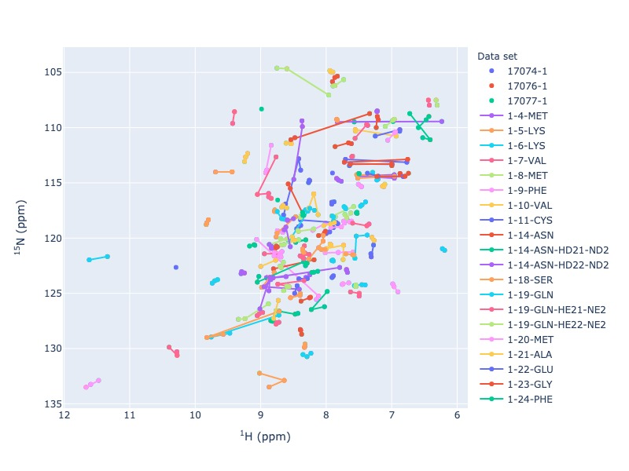
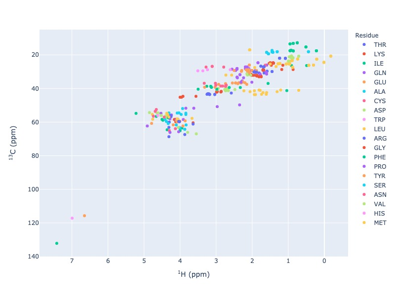
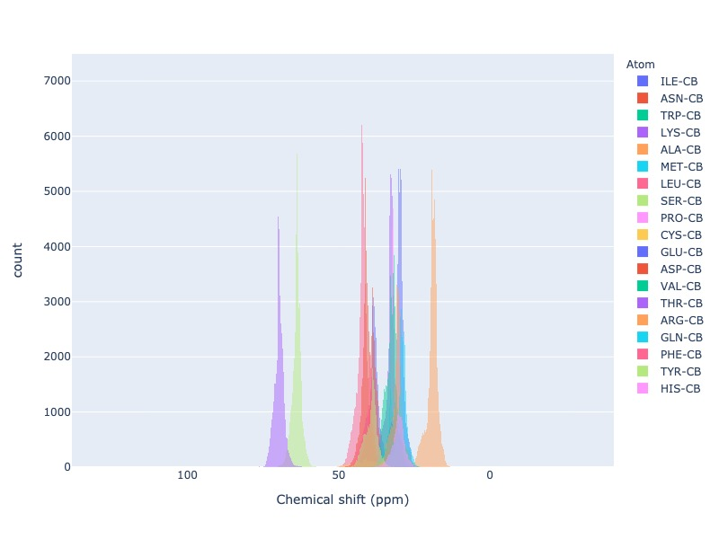

Welcome to PyBMRB!
======================================

A Python module for visualizing Nuclear Magnetic Resonance(NMR)  chemical shift data from Biological Magnetic
Resonance data Bank (`BMRB <http://bmrb.io>`_) and  from NMR-STAR :footcite:`Ulrich2019` format files. PyBMRB helps the
users to view the one dimensional chemical shift list as multi-dimensional NMR spectra. Chemical shift distributions
can be studied using this library by plotting the histograms using differnt filtering criteria.

This package uses `PyNMRSTAR <https://github.com/uwbmrb/PyNMRSTAR>`_ to parse the NMR-STAR files
and `BMRB-API <https://github.com/uwbmrb/BMRB-API>`_ to fetch the data directly from BMRB, which avoids the hustle of
downloading and parsing the data from the BMRB for visualizations. This package is developed and maintained by BMRB

|BuildStatus| |License| | |PythonVersions|

Sample visualizations
~~~~~~~~~~~~~~~~~~~~~~~~

Click the figure caption for interactive visualization

    `Figure 1 <_static/n15hsqc_compare2.html>`_ :  |n15| -HSQC

    `Figure 2 <_static/c13hsqc.html>`_ :  |c13| -HSQC

    `Figure 3 <_static/cbhist.html>`_ :  CB-Histogram

.. figure:: _images/cys-n-cb.jpg
    :alt: cys-n-cb
    :align: center

    `Figure 4 <_static/cys-n-cb.html>`_ :  Chemical shift correlation of CYS N and CB

.. |n15| replace:: :sup:`1` H - :sup:`15` N
.. |c13| replace:: :sup:`1` H - :sup:`13` C
.. |hh| replace:: :sup:`1` H - :sup:`1` H

.. toctree::
   :maxdepth: 2
   :caption: Contents:

   usage/pybmrb-introduction
   usage/quick-start
   usage/example
   usage/full
   release-notes

.. |PythonVersions| image:: https://img.shields.io/pypi/pyversions/pynmrstar.svg
   :target: https://github.com/uwbmrb/PyBMRB

.. |License| image::  https://img.shields.io/github/license/kumar-physics/PyBMRB
   :target: https://github.com/uwbmrb/PyBMRB

.. |BuildStatus| image:: https://img.shields.io/github/workflow/status/kumar-physics/PyBMRB/CI/dev
   :target: https://github.com/uwbmrb/PyBMRB

.. footbibliography::