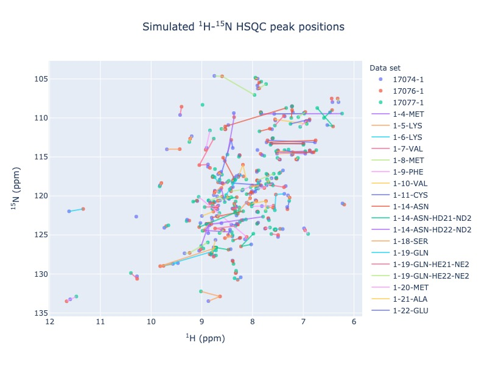
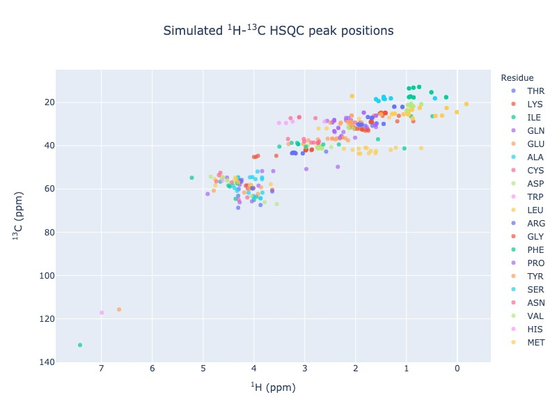
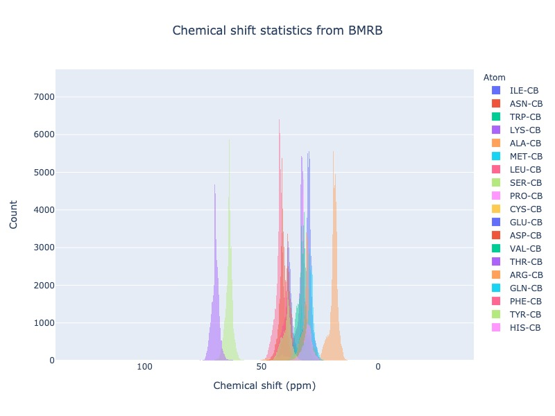
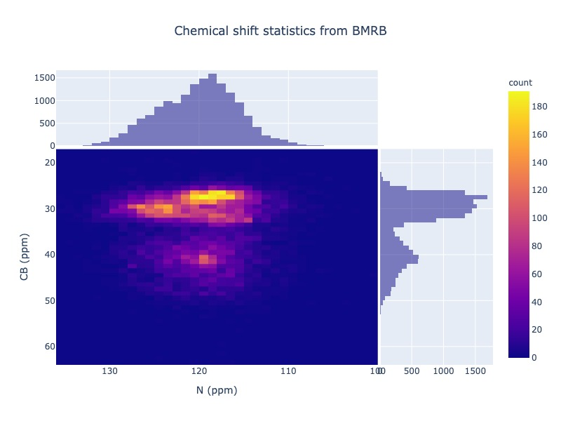

Welcome to PyBMRB :footcite:`Baskaran2021`
=============================================

A Python module for visualizing Nuclear Magnetic Resonance(NMR)  chemical shift data from Biological Magnetic
Resonance data Bank :footcite:`Ulrich2007` (`BMRB <http://bmrb.io>`_) and  from NMR-STAR :footcite:`Ulrich2019` format files.  PyBMRB helps the
user to view the one dimensional chemical shift list a multi-dimensional NMR spectrum.  In addition to that  Chemical shift distribution of
different atom types can also be visualized as histograms and heatmaps using this library.

This package uses `PyNMRSTAR <https://github.com/uwbmrb/PyNMRSTAR>`_ to parse the NMR-STAR files
and `BMRB-API <https://github.com/uwbmrb/BMRB-API>`_ to fetch the data directly from BMRB, which avoids the hassle of
downloading and parsing the data from BMRB for visualization purpose.  This package is developed and maintained by BMRB.

|BuildStatus| |License| | |PythonVersions| |binder|

Sample visualizations
~~~~~~~~~~~~~~~~~~~~~~~~

Click the figure caption for interactive visualization

    `Figure 1 <_static/sample_n15hsqc.html>`_ :  |n15| -HSQC

    `Figure 2 <_static/sample_c13hsqc.html>`_ :  |c13| -HSQC

    `Figure 3 <_static/sample_cbhist.html>`_ :  CB-Histogram

    `Figure 4 <_static/sample_hist2d.html>`_ :  Chemical shift correlation of CYS N and CB

.. |n15| replace:: :sup:`1` H - :sup:`15` N
.. |c13| replace:: :sup:`1` H - :sup:`13` C
.. |hh| replace:: :sup:`1` H - :sup:`1` H

.. toctree::
   :maxdepth: 2
   :caption: Contents:

   usage/pybmrb-introduction
   usage/quick-start
   usage/example
   usage/full
   release-notes

.. |PythonVersions| image:: https://img.shields.io/pypi/pyversions/pynmrstar.svg
   :target: https://github.com/uwbmrb/PyBMRB

.. |License| image::  https://img.shields.io/github/license/kumar-physics/PyBMRB
   :target: https://github.com/uwbmrb/PyBMRB

.. |BuildStatus| image:: https://img.shields.io/github/workflow/status/kumar-physics/PyBMRB/CI/dev
   :target: https://github.com/uwbmrb/PyBMRB

.. |binder| image:: https://mybinder.org/badge_logo.svg
 :target: https://mybinder.org/v2/gh/uwbmrb/PyBMRB/v3

.. footbibliography::