Examples
========

Load the package into your python environment using the following command

.. code:: python

    import pybmrb

.. |n15| replace:: :sup:`1` H - :sup:`15` N
.. |c13| replace:: :sup:`1` H - :sup:`13` C
.. |hh| replace:: :sup:`1` H - :sup:`1` H

Spectra simulation
--------------------
PyBMRB combines the chemical shift information from BMRB entries or NMR-STAR files using certain rules defined by the
experiment type. In this method it can generate |n15| - HSQC, |c13| -HSQC and |HH|-TOCSY. You may define which atom to
be on X axis and which atom to be on Y axis to generate through bond correlation 2D spectrum.

|n15| - HSQC peak position simulation
^^^^^^^^^^^^^^^^^^^^^^^^^^^^^^^^^^^^^^
- Example 1: Single entry from BMRB

.. code:: python

    pybmrb.Spectra.n15hsqc(bmrb_ids=15060, legend='residue')

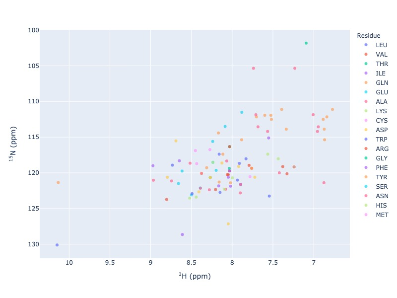

    `Click here for interactive html for n15-HSQC from BMRB entry 15060 <../_static/15060_n15.html>`_

- Example 2: Multiple entries from BMRB along with a NMR-STAR file.

For multiple data set use data set as legend, so that you may turn on and off different data set.
You may also use residue as legend to turn on and off different residue types

.. code:: python

    pybmrb.Spectra.n15hsqc(bmrb_ids=[17076,17077],
    file_names='test_data/MyData.str',
    legend='dataset')

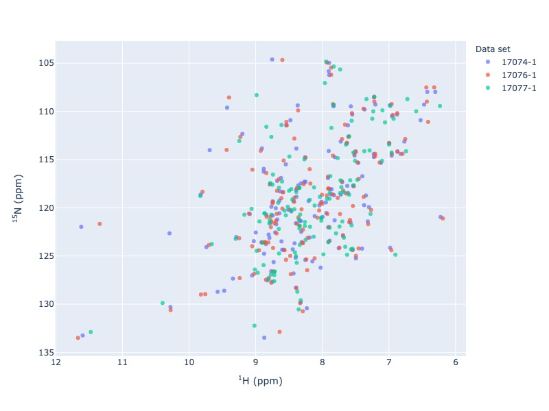

    `Click here for interactive html for n15-HSQC from BMRB entries along with NMR-STAR file <../_static/multi_n15.html>`_

- Example 3: Multiple entries from BMRB along with a NMR-STAR file and a peak list in csv format

.. code:: python

    pybmrb.Spectra.n15hsqc(bmrb_ids=[17076,17077],
    file_names='test_data/MyData.str',
    peak_list='test_data/my_peak_list.csv',
    legend='dataset')

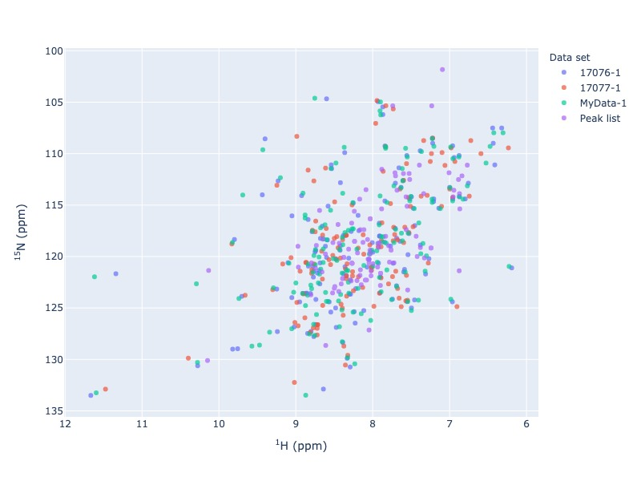

    `Click here for interactive html for n15-HSQC from BMRB entries along with NMR-STAR file and a peak list <../_static/multi_n152.html>`_

- Example 4: Multiple entries from BMRB with chemical shift tracking

.. code:: python

    pybmrb.Spectra.n15hsqc(bmrb_ids=[17076,17077],
    file_names='test_data/MyData.str',
    legend='dataset',
    draw_trace=True)

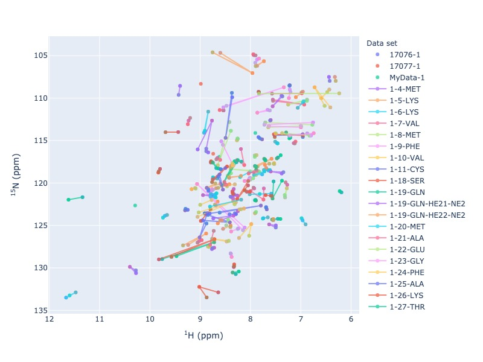

    `Click here for interactive html for n15-HSQC from BMRB entries 17074,17076 and 17076 with trace <../_static/multi2_n15.html>`_

|c13| - HSQC peak position simulation
^^^^^^^^^^^^^^^^^^^^^^^^^^^^^^^^^^^^^^^^

- Example 5: Single entry from BMRB

.. code:: python

    pybmrb.Spectra.c13hsqc(bmrb_ids=15060, legend='residue')

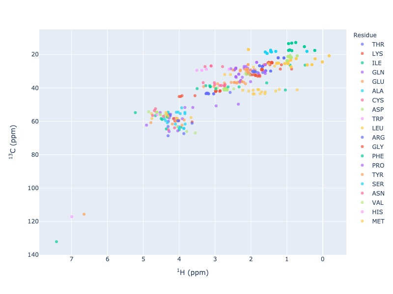

    `Click here for interactive html for c13-HSQC from BMRB entry 15060 <../_static/15060_c13.html>`_

- Example 6: Multiple entries from BMRB

.. code:: python

    pybmrb.Spectra.c13hsqc(bmrb_ids=[17074,17076,17077], legend='dataset')

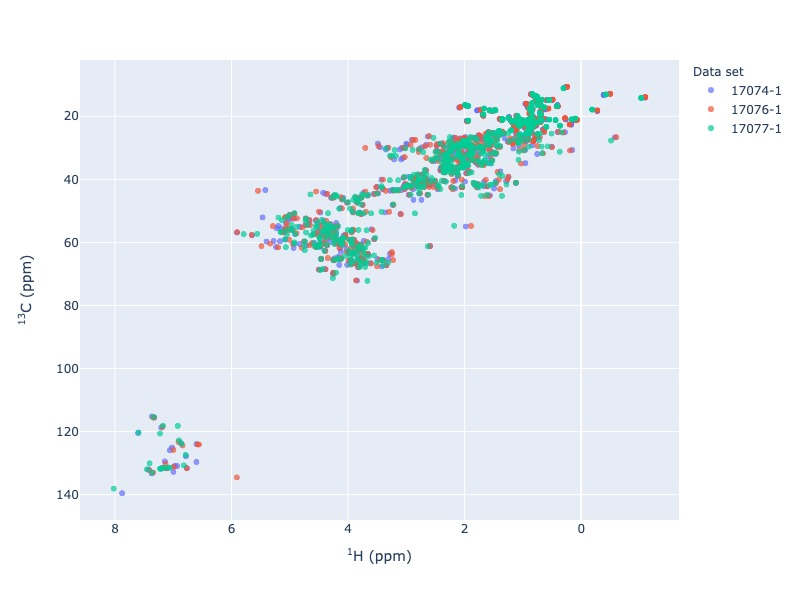

    `Click here for interactive html for c13-HSQC from BMRB entries 17074,17076 and 17076 <../_static/multi_c13.html>`_

- Example 7: Multiple entries from BMRB with chemical shift tracking

.. code:: python

    pybmrb.Spectra.c13hsqc(bmrb_ids=[17074,17076,17077], legend='dataset', draw_trace=True)

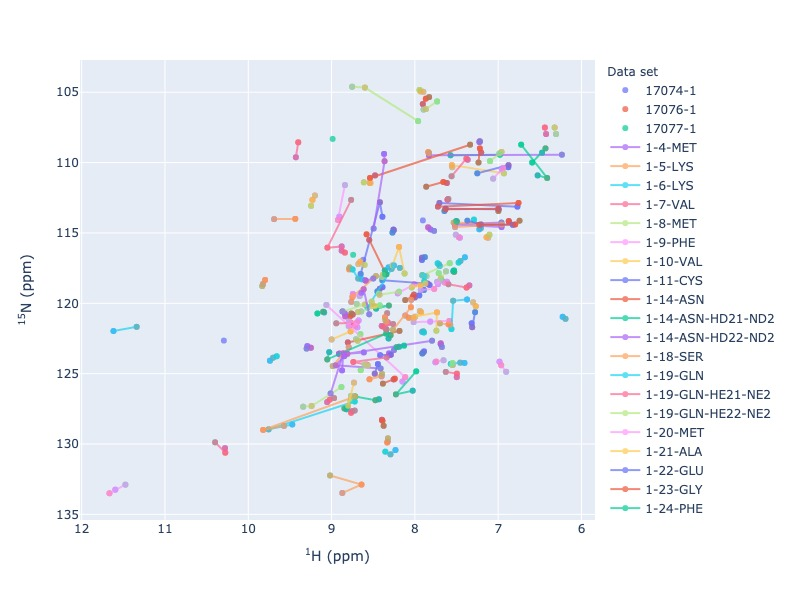

    `Click here for interactive html for c13-HSQC from BMRB entries 17074,17076 and 17076 with trace <../_static/multi2_c13.html>`_

|hh| - TOCSY peak position simulation
^^^^^^^^^^^^^^^^^^^^^^^^^^^^^^^^^^^^^^^^^

- Example 8: Single entry from BMRB

.. code:: python

    pybmrb.Spectra.tocsy(bmrb_ids=15060, legend='residue')

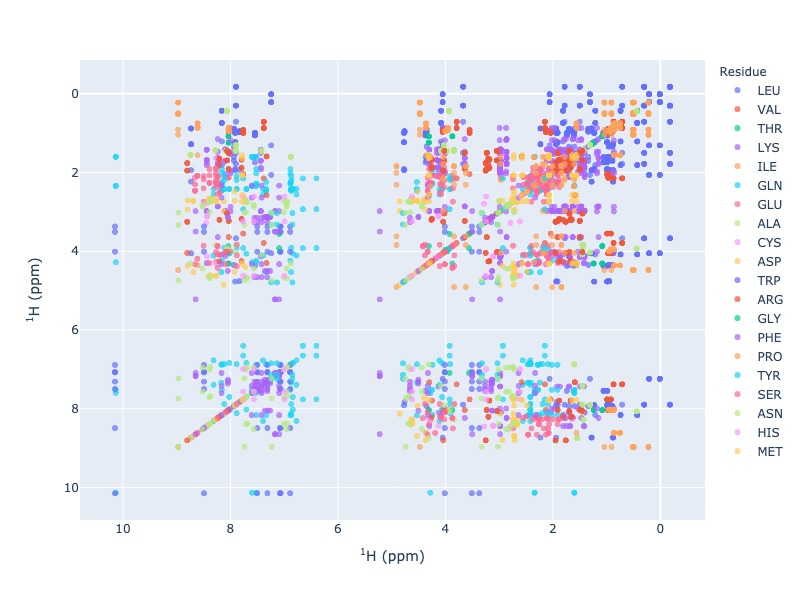

    `Click here for interactive html for TOCSY from BMRB entry 15060 <../_static/15060_tocsy.html>`_

- Example 9: Multiple entries from BMRB

.. code:: python

    pybmrb.Spectra.tocsy(bmrb_ids=[17074,17076,17077], legend='dataset')

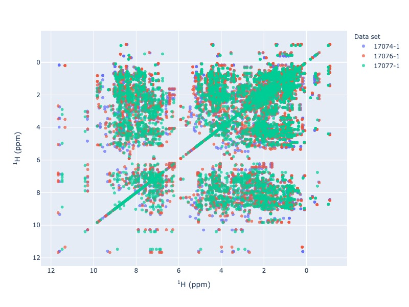

    `Click here for interactive html for TOCSY from BMRB entries 17074,17076 and 17076 <../_static/multi_tocsy.html>`_

- Example 10: Multiple entries from BMRB with residues as legend

.. code:: python

    pybmrb.Spectra.tocsy(bmrb_ids=[17074,17076,17077], legend='residue')

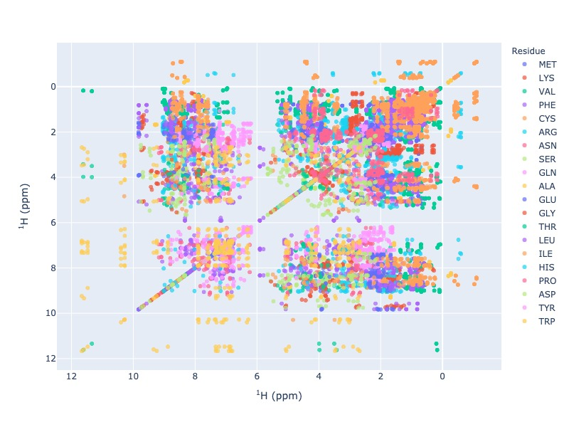

    `Click here for interactive html for TOCSY from BMRB entries 17074,17076 and 17076 with residues as legend <../_static/multi_tocsy2.html>`_

- Example 11 : Multiple entries from BMRB with chemical shift tracking

.. code:: python

    pybmrb.Spectra.tocsy(bmrb_ids=[17074,17076,17077], legend='dataset', draw_trace=True)

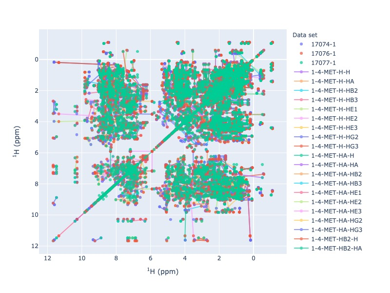

    `Click here for interactive html for TOCSY from BMRB entries 17074,17076 and 17076 with trace <../_static/multi2_tocsy.html>`_

Please not the above TOCSY with chemical shift visualization will take some time to load, because of hundreds of traces

Generic 2D peak position simulation
^^^^^^^^^^^^^^^^^^^^^^^^^^^^^^^^^^^^^^^

You may use any two atoms in a residue to generate a generic 2D spectrum. For the following examples, N chemical shifts
were used as  x axis and CB chemical shifts were was used a Y axis.

- Example 12: Single entry from BMRB

.. code:: python

    pybmrb.Spectra.c13hsqc(bmrb_ids=15060,
    atom_x='N',
    atom_y='CB',
    legend='residue')

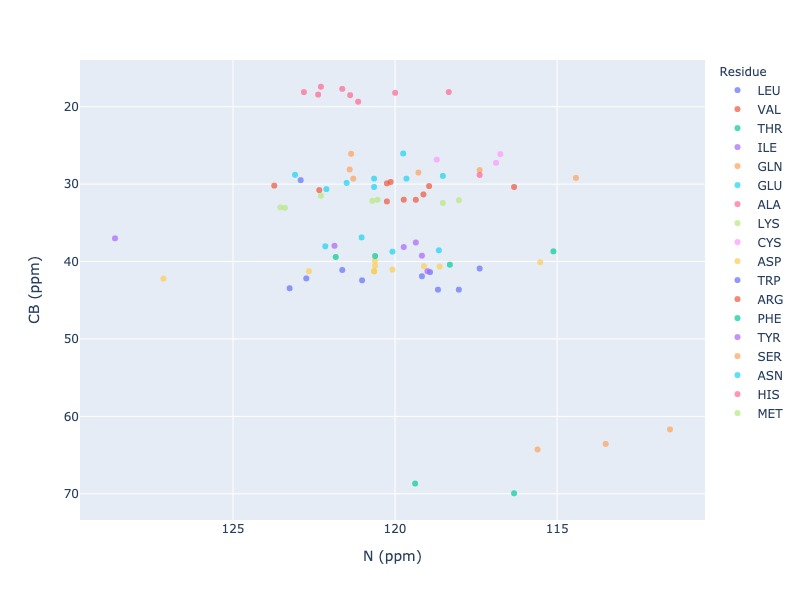

    `Click here for interactive html for generic 2D spectrum from BMRB entry 15060 <../_static/15060_2d.html>`_

- Example 13: Multiple entries from BMRB

.. code:: python

    pybmrb.Spectra.c13hsqc(bmrb_ids=[17074,17076,17077],
    atom_x='N',
    atom_y='CB',
    legend='dataset')

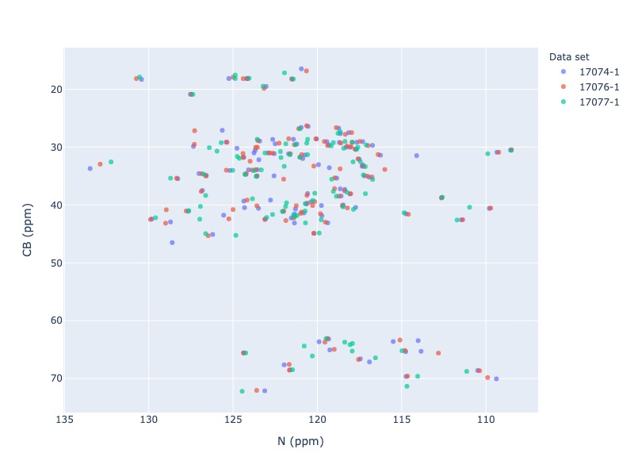

    `Click here for interactive html for generic 2D spectrum from BMRB entries 17074,17076 and 17076 <../_static/multi_2d.html>`_

- Example 14: Multiple entries from BMRB with chemical shift tracking

.. code:: python

    pybmrb.Spectra.c13hsqc(bmrb_ids=[17074,17076,17077],
    atom_x='N',
    atom_y='CB',
    legend='dataset',
    draw_trace=True)

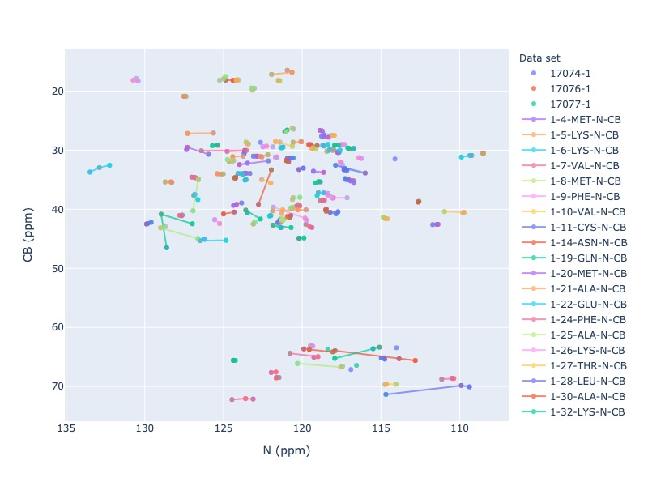

    `Click here for interactive html for generic 2D spectrum from BMRB entries 17074,17076 and 17076 with trace <../_static/multi2_2d.html>`_

Chemical shift Histograms
---------------------------

text

Histogram
^^^^^^^^^^^

test