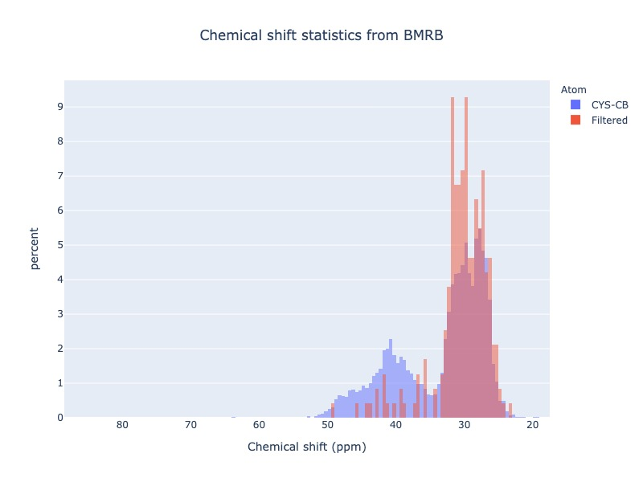

Examples
========

Load the package into your python environment using the following command

.. code:: python

    from pybmrb import Spectra, Histogram

.. |n15| replace:: :sup:`1` H - :sup:`15` N
.. |c13| replace:: :sup:`1` H - :sup:`13` C
.. |hh| replace:: :sup:`1` H - :sup:`1` H

Spectra simulation
--------------------
PyBMRB combines the chemical shift information from BMRB entries or NMR-STAR files using certain rules defined by the
experiment type. In this method it can generate |n15| - HSQC, |c13| -HSQC and |HH|-TOCSY. You may define which atom to
be on X axis and which atom to be on Y axis to generate a generic 2D correlation spectrum.

|n15| - HSQC peak position simulation
^^^^^^^^^^^^^^^^^^^^^^^^^^^^^^^^^^^^^^
- Example 1: Single entry from BMRB

.. code:: python

    peak_list=Spectra.n15hsqc(bmrb_ids=15060, legend='residue')

    `Click here for interactive html for n15-HSQC from BMRB entry 15060 <../_static/example1.html>`_

- Example 2: Multiple entries from BMRB along with a NMR-STAR file.

For multiple data set use data set as legend, so that you may turn on and off different data set.
You may also use residue as legend to turn on and off different residue types

.. code:: python

    peak_list=Spectra.n15hsqc(bmrb_ids=[17076,17077], input_file_names='test_data/MyData.str', legend='dataset')

.. figure:: ../_images/example2.jpg
    :alt: n15hsqc
    :align: center

    `Click here for interactive html for n15-HSQC from BMRB entries along with NMR-STAR file <../_static/example2.html>`_

- Example 3: Multiple entries from BMRB along with a NMR-STAR file and a peak list in csv format

.. code:: python

    peak_list=Spectra.n15hsqc(bmrb_ids=[17076,17077], input_file_names='test_data/MyData.str', peak_list='test_data/my_peak_list.csv', legend='dataset')

    `Click here for interactive html for n15-HSQC from BMRB entries along with NMR-STAR file and a peak list <../_static/example2.html>`_

- Example 4: Multiple entries from BMRB with chemical shift tracking

.. code:: python

    peak_list=Spectra.n15hsqc(bmrb_ids=[17076,17077], input_file_names='test_data/MyData.str', legend='dataset', draw_trace=True)

    `Click here for interactive html for n15-HSQC from BMRB entries 17074,17076 and 17076 with trace <../_static/example4.html>`_

|c13| - HSQC peak position simulation
^^^^^^^^^^^^^^^^^^^^^^^^^^^^^^^^^^^^^^^^

- Example 5: Single entry from BMRB

.. code:: python

    peak_list=Spectra.c13hsqc(bmrb_ids=15060, legend='residue')

.. figure:: ../_images/example5.jpg
    :alt: n15hsqc
    :align: center

    `Click here for interactive html for c13-HSQC from BMRB entry 15060 <../_static/example5.html>`_

- Example 6: Multiple entries from BMRB

.. code:: python

    peak_list=Spectra.c13hsqc(bmrb_ids=[17074,17076,17077], legend='dataset')

    `Click here for interactive html for c13-HSQC from BMRB entries 17074,17076 and 17076 <../_static/example6.html>`_

- Example 7: Multiple entries from BMRB with chemical shift tracking

.. code:: python

    peak_list=Spectra.c13hsqc(bmrb_ids=[17074,17076,17077], legend='dataset', draw_trace=True)

    `Click here for interactive html for c13-HSQC from BMRB entries 17074,17076 and 17076 with trace <../_static/example7.html>`_

|hh| - TOCSY peak position simulation
^^^^^^^^^^^^^^^^^^^^^^^^^^^^^^^^^^^^^^^^^

- Example 8: Single entry from BMRB

.. code:: python

    peak_list=Spectra.tocsy(bmrb_ids=15060, legend='residue')

    `Click here for interactive html for TOCSY from BMRB entry 15060 <../_static/example8.html>`_

- Example 9: Multiple entries from BMRB

.. code:: python

    peak_list=Spectra.tocsy(bmrb_ids=[17074,17076,17077], legend='dataset')

    `Click here for interactive html for TOCSY from BMRB entries 17074,17076 and 17076 <../_static/example9.html>`_

- Example 10: Multiple entries from BMRB with residues as legend

.. code:: python

    peak_list=Spectra.tocsy(bmrb_ids=[17074,17076,17077], legend='residue')

    `Click here for interactive html for TOCSY from BMRB entries 17074,17076 and 17076 with residues as legend <../_static/example10.html>`_

- Example 11 : Multiple entries from BMRB with chemical shift tracking

.. code:: python

    peak_list=Spectra.tocsy(bmrb_ids=[17074,17076,17077], legend='dataset', draw_trace=True)

    `Click here for interactive html for TOCSY from BMRB entries 17074,17076 and 17076 with trace <../_static/example11.html>`_

Please not the above TOCSY with chemical shift visualization will take some time to load, because of hundreds of traces

Generic 2D peak position simulation
^^^^^^^^^^^^^^^^^^^^^^^^^^^^^^^^^^^^^^^

You may use any two atoms in a residue to generate a generic 2D spectrum. For the following examples, N chemical shifts
were used as  x axis and CB chemical shifts were was used a Y axis.

- Example 12: Single entry from BMRB

.. code:: python

    peak_list=Spectra.generic_2d(bmrb_ids=15060, atom_x='N', atom_y='CB', legend='residue')

    `Click here for interactive html for generic 2D spectrum from BMRB entry 15060 <../_static/example12.html>`_

- Example 13: Multiple entries from BMRB

.. code:: python

    peak_list=Spectra.generic_2d(bmrb_ids=[17074,17076,17077], atom_x='N', atom_y='CB', legend='dataset')

    `Click here for interactive html for generic 2D spectrum from BMRB entries 17074,17076 and 17076 <../_static/example13.html>`_

- Example 14: Multiple entries from BMRB with chemical shift tracking

.. code:: python

    peak_list=Spectra.generic_2d(bmrb_ids=[17074,17076,17077], atom_x='N', atom_y='CB', legend='dataset', draw_trace=True)

    `Click here for interactive html for generic 2D spectrum from BMRB entries 17074,17076 and 17076 with trace <../_static/example14.html>`_

- Example 15: Include chemical shifts from preceding residue in the generic 2d spectrum

You may also include chemical shift from i-1 atom in the generic 2D spectrum, which will be shown using different size

.. code:: python

    peak_list = Spectra.generic_2d((bmrb_ids=15000, atom_x='N', atom_y='CA', include_preceding=True, legend='residue')

    `Click here for interactive html for generic 2D spectrum with preceding residue <../_static/example15.html>`_

- Example 16: Draw trace to show the walk along the sequence

You may draw a trace connecting i-1 to i to next i-1 and so on as long as the sequence is continuous. If you have missing
chemical shift, then the trace will start from next possible residue

.. code:: python

    peak_list = Spectra.generic_2d((bmrb_ids=15000, atom_x='N', atom_y='CA', include_preceding=True, legend='residue', seq_walk=True)

    `Click here for interactive html for generic 2D spectrum with preceding residue and sequence walk <../_static/example16.html>`_

- Example 17: Include chemical shift from next residues in the generic 2d spectrum

You may also include chemical shift from i+1 atoms in the generic 2D spectrum, which will be shown using different size

.. code:: python

    peak_list = Spectra.generic_2d((bmrb_ids=15000, atom_x='N', atom_y='CA', include_next=True, legend='residue')

    `Click here for interactive html for generic 2D spectrum with next residue <../_static/example17.html>`_

- Example 18: Draw trace to show the walk along the sequence

You may draw a trace connecting i+1 to i to next i+1 and so on as long as the sequence is continuous. If you have missing
chemical shift, then the trace will start from next possible residue

.. code:: python

    peak_list = Spectra.generic_2d((bmrb_ids=15000, atom_x='N', atom_y='CA', include_next=True, legend='residue', seq_walk=True)

    `Click here for interactive html for generic 2D spectrum with next residue and sequence walk <../_static/example18.html>`_

- Example 19: Draw trace to show the walk along the sequence ignoring missing residues

you may also draw traces from starting residue to end residue ignoring the missing ones

.. code:: python

    peak_list = Spectra.generic_2d((bmrb_ids=15000, atom_x='N', atom_y='CA', include_next=True, legend='residue',  full_walk = True)

    `Click here for interactive html for generic 2D spectrum with next residue and full sequence walk <../_static/example19.html>`_

Chemical shift Histograms
---------------------------

PyBMRB is able to fetch database wide chemical shift data and plot the distribution in different ways.
The default distribution would be Chemical shift vs number of instances(count). You may also plot the 'percent' or 'probability'
or 'probability density' by providing desired value for 'histnorm'. These distributions
can be filtered using temperature range and PH range. Here are some of the examples.

Single distribution
^^^^^^^^^^^^^^^^^^^^

- Example 20: Chemical shift distribution of CYS-CB

.. code:: python

    cs_data=Histogram.hist(residue='CYS', atom='CB')

    `Click here for interactive html for CYS-CB histogram <../_static/example20.html>`_

- Example 21: Chemical shift distribution of CYS-CB with standard deviation cs_filt

You may exclude extreme values by using the cs_filt based on standard deviation. sd_limit=5 would  exclude
the values beyond 5 times standard deviation on moth sides of the mean

.. code:: python

    cs_data=Histogram.hist(residue='CYS', atom='CB', sd_limit=5 )

    `Click here for interactive html for CYS-CB histogram with in 5 std on both sides of the mean <../_static/example21.html>`_

- Example 22: Chemical shift distribution of CYS-CB with Ph cs_filt

You may use experimental conditions like  Ph or temperature values as a cs_filt

.. code:: python

    cs_data=Histogram.hist(residue='CYS', atom='CB', sd_limit=5, ph_min=7.0, ph_max=8.2)

    `Click here for interactive html for CYS-CB histogram with Ph cs_filt <../_static/example22.html>`_

- Example 23: Chemical shift distribution of CYS-CB as box plot

Box plot and Violin plot will show all the statistical properties of the distribution, when you mouse over the distribution.

.. code:: python

    cs_data=Histogram.hist(residue='CYS', atom='CB', plot_type='box')

    `Click here for interactive html for CYS-CB box plot <../_static/example23.html>`_

- Example 24: Chemical shift distribution of CYS-CB as violin plot

Box plot and Violin plot will show all the statistical properties of the distribution, when you mouse over the distribution.

.. code:: python

    cs_data=Histogram.hist(residue='CYS', atom='CB', plot_type='violin')

.. figure:: ../_images/example24.jpg
    :alt: n15hsqc
    :align: center

    `Click here for interactive html for CYS-CB violin plot <../_static/example24.html>`_

Multiple distribution
^^^^^^^^^^^^^^^^^^^^^^

- Example 25: Histogram from list of atoms

You may also provide list of atoms as input

.. code:: python

    cs_data=Histogram.hist(list_of_atoms=['GLN-CB','CYS-CB','TYR-CB'], histnorm='probability density')

    `Click here for interactive html for multiple distribution <../_static/example25.html>`_

- Example 26: Violin plot for list of atoms

.. code:: python

    cs_data=Histogram.hist(list_of_atoms=['GLN-CB','CYS-CB','TYR-CB'], plot_type='violin')

    `Click here for interactive html for violin plot <../_static/example26.html>`_

- Example 27: Histogram method supports wildcard

If you want to see the chemical shift distribution of protons in GLN, then you may use the following command.
You may chose histnorm as 'probability density' to compare distributions

.. code:: python

    cs_data=Histogram.hist(residue='GLN', atom='H*', histnorm='probability density')

    `Click here for interactive html for GLN-H* distribution <../_static/example27.html>`_

- Example 28: Distribution of all atoms from a residue

If you want to see the chemical shift distribution of all atoms from a residue you may use atom='*' or simply leave out atom.

.. code:: python

    cs_data=Histogram.hist(residue='ASP', atom='*')

or

.. code:: python

    cs_data=Histogram.hist(residue='ASP')

    `Click here for interactive html for ASP distribution <../_static/example28.html>`_

- Example 29: Distribution of specific atom type from al residues

If you want to see the chemical shift distribution CG atoms from all 20 standard residues you may use residue=*' or simply leave out residue.

.. code:: python

    cs_data=Histogram.hist(residue='*', atom='CG*', histnorm='percent')

or

.. code:: python

    cs_data=Histogram.hist(atom='CG*', histnorm='percent')

.. figure:: ../_images/example29.jpg
    :alt: n15hsqc
    :align: center

    `Click here for interactive html for CG* distribution <../_static/example29.html>`_

2D Histograms
^^^^^^^^^^^^^^^^^^^^

- Example 30: Chemical shift correlation as 2d heatmap

.. code:: python

    cs_data=Histogram.hist2d(residue='CYS', atom1='CA', atom2='CB', sd_limit=5)

    `Click here for interactive 2D heatmap  <../_static/example30.html>`_

- Example 31: Chemical shift correlation as contour heatmap

.. code:: python

    cs_data=Histogram.hist2d(residue='GLN', atom1='HE21', atom2='HE22', sd_limit=5, plot_type='contour')

    `Click here for interactive contour plot  <../_static/example31.html>`_

Conditional histogram
^^^^^^^^^^^^^^^^^^^^^^

- Example 32: Conditional histogram with chemical shift filtering

You may cs_filt the chemical shift distribution of an atom in a residue based on the chemical shift values of one or
more atom in the same residue. In the following example CYS-CB values are filtered based on CYS-H=8.9. During the seach
0.1ppm tolerance for protons and 2.0 ppm tolerance for heavy atoms is used.

.. code:: python

    cs_data=Histogram.conditional_hist(residue='CYS', atom='CB', histnorm='percent', filtering_rules=[('H',8.9)])

    `Click here for interactive conditional histogram with one rule  <../_static/example32.html>`_

- Example 33: Conditional histogram with chemical shift list

.. code:: python

    cs_data=Histogram.conditional_hist(residue='CYS', atom='CB', histnorm='percent', filtering_rules=[('H', 8.9), ('CA', 61)])

    `Click here for interactive conditional histogram with list of rules  <../_static/example33.html>`_

Data manipulation
-------------------

If you are interested only in data manipulation please refer :ref:`ChemicalShift<ChemicalShift>` and :ref:`ChemicalShiftStatistics<ChemicalShiftStatistics>` modules in :ref:`Modules documentation<Module documentation>`.