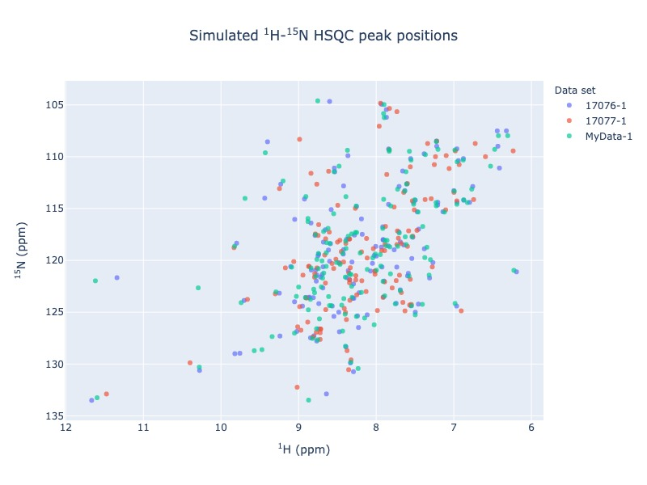
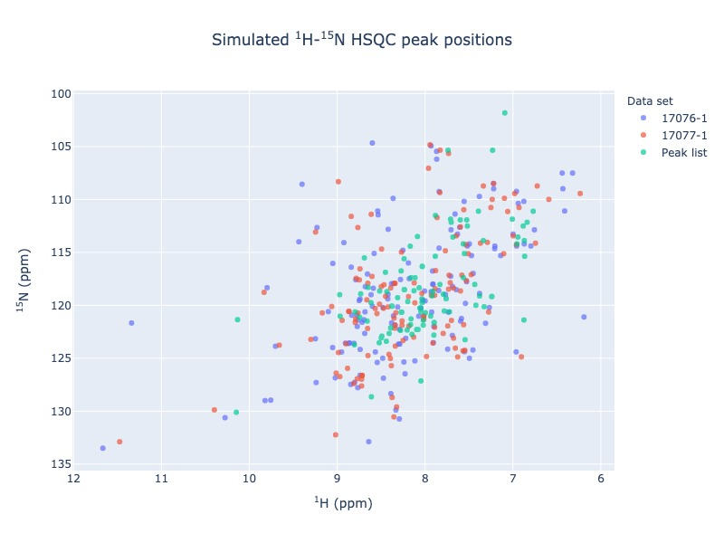
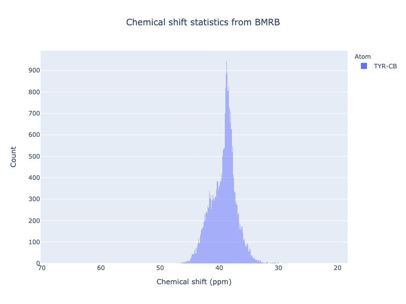
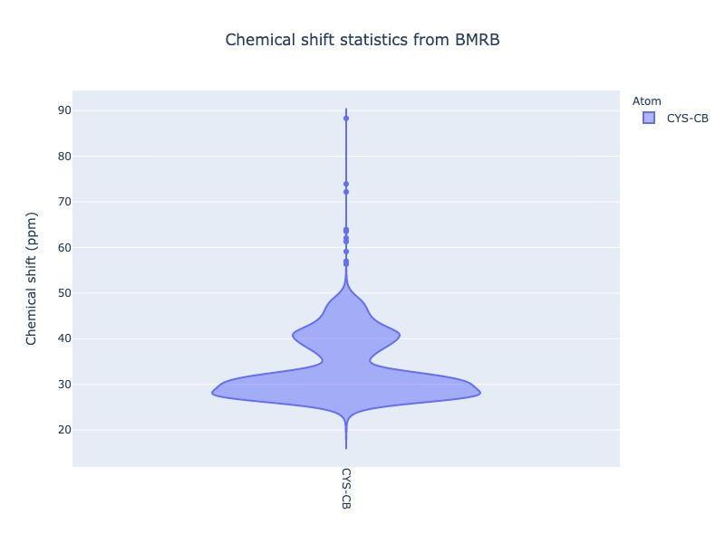
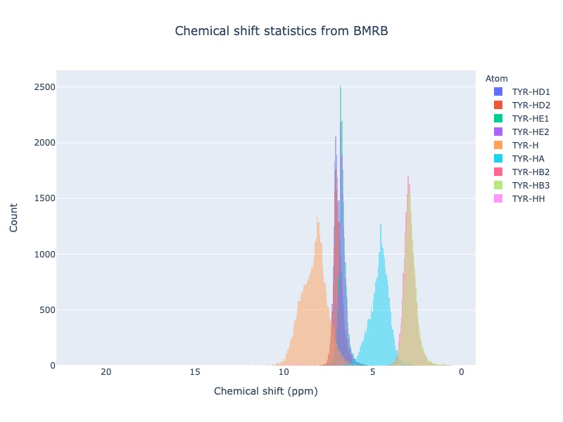
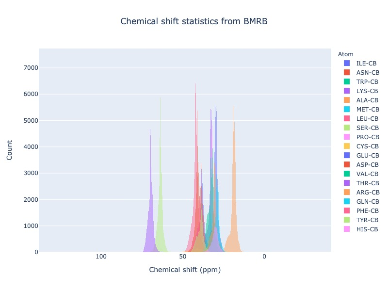
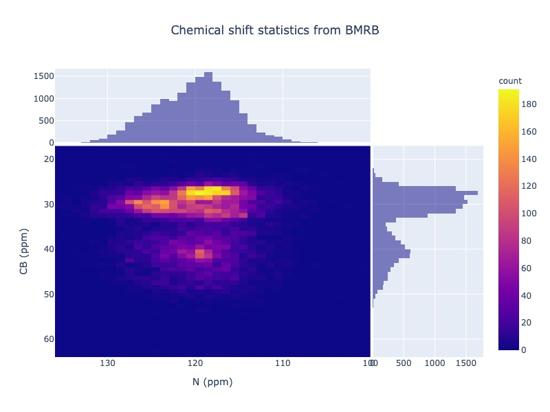

PyBMRB quick start
======================

Installation
~~~~~~~~~~~~~

PyBMR is available in the Python Package Index (`PyPI <https://pypi.org/project/pybmrb/>`_), which can be installed
easily using the following command

.. code:: bash

    pip install pybmrb

Input
~~~~~~

PyBMR is designed to fetch the data directly from BMRB for all its visualization involving BMRB data. However,
optionally NMR-STAR files with chemical shift information or a simple csv file(peak list) with two columns can also be used as an input.
All that You need know is just the BMRB entry IDs and the IUPAC names for the residue/atom of your interest.

Parameters
--------------------
Here is the list of some useful parameters. Full list of parameters are documented in the :ref:`Modules documentation page<Module documentation>`.

* **bmrb_ids**\  either single BMRB id or list of BMRB IDs as a list; example *bmrb_ids = 15060*\  or *bmrb_is = [17074, 17076, 17077]*
* **input_file_names**\  local NMR-STAR file or list of files with full path; example *input_file_names = 'test/test_data/mydata1.str'*\  or *input_file_names=['test/test_data/mydata1.str', 'test/test_data/mydata2.str']*\

For chemical shift histograms, you need to know the three letter code for the amino acid and its IUPAC atom name

* **residue**\  three letter code or two letter nucleic acid code; example *residue = 'ALA'*\  or *residue = ['ALA', 'GLY', 'PHE']*\
* **atom**\  atom name in IUPAC format and it supports wildcard ; example atom='HD21' or *atom = 'HD*'*\  or *atom=['CG', 'C', 'CG']*\
* **list_of_atoms**\  you may also provide as list of atom as follows ; example *list_of_atoms = ['TYR-CB', 'VAL-CB']*\

Optional
---------------
You may customize the visualization using some of the optional  parameters

* **auth_tag**\  BMRB entries and NMR-STAR files may contain two sets of sequence numbering. One is the standard numbering staring from 1 stored in Comp_index_ID and the other is the author provided sequence stored in Auth_seq_id. By default it uses the sequence from Comp_index_ID. If you want to use author provided sequence numbering the make this true; example *auth_tag=True*\
* **legend**\  Showing the legend for spectra simulation is disabled by default. If uses shapes to distinguish  data sets and colors to distinguish residue type. Showing this combination in legends is exhaustive. However you may chose one to show as the legend. example *legend='dataset'*\  or *legend='residue'*\
* **draw_trace**\  While comparing multiple entries or comparing BMRB entreis with your local NMR-STAR files, you may chose to trace the changes in peak positions for matching residues in the sequence. This will connect the peaks from the corresponding residues from different data set using a line. example *draw_trace=True*\
* **peak_list**\  Optionally you may also provide peak list as a simple csv file to plot with any BMRB entry or your local NMR-STAR files. The difference is NMR-STAR files contain assigned chemical shifts, while the peak list is just a list of peak positions in two columns. example *peak_list='/test/peak_list1.csv'*\

for chemical shift histograms, you may plot either count/percent/probability/probability density.If don't specify anything the  default would be count

* **histnorm**\  normalization method 'percent' (or) 'probability'(or) 'probability density'

Output format
----------------
All spectra and histograms automatically open on your browser as an interactive visualization. If you wish to store them as interactive visualization,
then you may write out as html file. If you want save them as static image, then you may chose 'jpg' or 'png' or 'pdf' or 'webp'.

* **show_visualization**\  If you don't want the visualization open autpmatically, then you may disable this feature by setting this flag False. example *show_visualization=False*\
* **output_file**\  Specify your output file name here with full path. File extensions are automatically added(if not specified) based on the output format type. example *output_file='output_path/myplot'*\
* **output_format**\  Supported formats html,jpg,png,pdf and webp. example *output_format='pdf'*\
* **output_image_width**\  Specify the width of the image; default 800. *example *output_image_width = 1200*\
* **output_image_height**\  Specify the height of the image; default 600. *example *output_image_width = 800*\

Quick start
~~~~~~~~~~~~~

First, pull up an interactive python session and import the package:

.. code:: python

    from pybmrb import Spectra, Histogram
    

View BMRB entry or NMR-STAR file as spectra
---------------------------------------------

Suppose you are working with a protein called arsenate reductase and you have your data in a NMR-STAR format.
You found out that there are already two arsenate reductase  entries (17076,17077) in the BMRB. You may now easily
compare your data with BMRB as overlying |n15| - HSQC spectra using the following command

.. code:: python

    peak_list = Spectra.n15hsqc(bmrb_ids=[17076,17077], input_file_names='tests/test_data/MyData.str', legend='dataset')

This will open the visualization on your default web browser. When you mouseover the tool-tip it will show the information
about each peak. You may turn on and off the data set using legend on the right.
`Click here to view the output1 <../_static/quick_start_n15hsqc_compare.html>`_

If you want the output as an image and not to open the visualization on web browser then use the following option

.. code:: python

    peak_list = Spectra.n15hsqc(bmrb_ids=[17076,17077], input_file_names='tests/test_data/MyData.str', legend='dataset', output_format='jpg', output_file='n15hsqc_compare.jpg', show_visualization = False)

    Comparing of local data with BMRB entries

The command will output the peak list information to the variable peak_list.

If you want to trace the chemical shift changes, use the following command

.. code:: python

    peak_list = Spectra.n15hsqc(bmrb_ids=[17076,17077], input_file_names='tests/test_data/MyData.str', legend='dataset', draw_trace = True)

`Click here to view the output2 <../_static/quick_start_n15hsqc_compare2.html>`_

If you don't have your data in NMR-STAR format, then no problem!. You may extract the peak list from any NMR spectra as
a csv file. You may use the csv file to compare your peak list with any BMRB entry

.. code:: python

    peak_list = Spectra.n15hsqc(bmrb_ids=[17076,17077], peak_list='tests/test_data/test_peak_list.csv', legend='dataset', draw_trace = True)

    Comparing of peak list with BMRB entries

Chemical shift statistics
---------------------------

You may easily generate chemical shift histogram of any atom or list of atoms or any residue with single command.

.. code:: python

    cs_data = Histogram.hist(residue='TYR', atom='CB')

    `Chemical shift distribution of TYR CB <../_static/quick_star_hist1.html>`_

Different plot types (box, violin) are also supported. Click the figure caption for html version. When you mouseover the
box and violin plots, it will show the statistical properties of the distribution

.. code:: python

    cs_data = Histogram.hist(residue='CYS', atom='CB',plot_type='box')

.. figure:: ../_images/quick_star_hist2.jpg
    :alt: tyr-cb
    :align: center

    `Box plot <../_static/quick_star_hist2.html>`_

.. code:: python

    cs_data = Histogram.hist(residue='CYS', atom='CB',plot_type='violin')

    `Violin plot <../_static/quick_star_hist3.html>`_

You may also use the wildcard

.. code:: python

    cs_data = Histogram.hist(residue='TYR', atom='H*')

    `Chemical shift distribution of TYR protons <../_static/quick_star_hist4.html>`_

Leaving out the residue will plot CB chemical shift distribution of all 20 standard amino acids

.. code:: python

    cs_data = Histogram.hist( atom='CB')

    `Chemical shift distribution of CB <../_static/quick_star_hist5.html>`_

You may also plot 2D chemical shift correlation plot for two atoms in the same residue

.. code:: python

    cs_data = Histogram.hist2d(residue='CYS',atom1='N', atom2='CB')

    `Chemical shift correlation <../_static/quick_star_hist6.html>`_

More examples can be found :ref:`Examples page<Examples>`.

.. |n15| replace:: :sup:`1` H - :sup:`15` N
.. |c13| replace:: :sup:`1` H - :sup:`13` C
.. |hh| replace:: :sup:`1` H - :sup:`1` H

.. footbibliography::